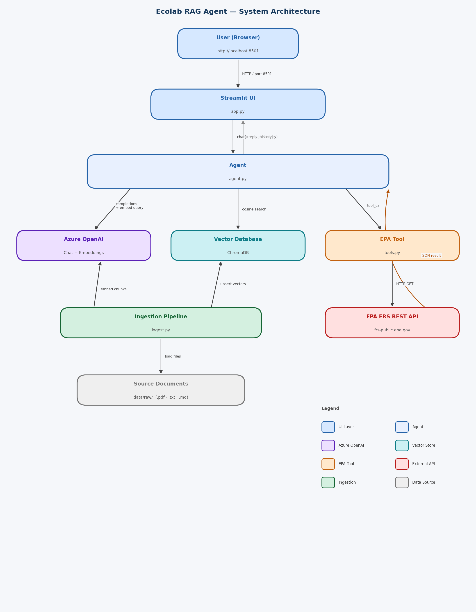

# Ecolab RAG Agent 

An intelligent conversational assistant for Ecolab's domains — **water treatment**, **hygiene**, and **sustainability** — powered by Retrieval-Augmented Generation (RAG). The agent answers questions by searching a private document corpus and can look up real-time EPA facility data for any US ZIP code.

---

## Table of Contents

- [Overview](#overview)
- [Architecture](#architecture)
- [Project Structure](#project-structure)
- [Component Explanations](#component-explanations)
- [Prerequisites](#prerequisites)
- [Setup](#setup)
- [Usage](#usage)
- [Running Tests](#running-tests)
- [Configuration Reference](#configuration-reference)
- [EPA Tool](#epa-tool)

---

## Overview

The system combines two knowledge sources:

| Source | What it covers |
|---|---|
| **Document corpus** (ChromaDB) | Ingested PDFs, text files, and markdown — e.g. WHO sanitation guidelines, product datasheets |
| **EPA Facility Registry Service** | Live data on Superfund sites, hazardous waste, air emissions, water discharge permits, and toxic release inventory at any US ZIP code |

When a user asks a question, the agent retrieves the most relevant document chunks, injects them into the LLM context, and answers with citations. If the question is about regulated facilities near a ZIP code, it automatically calls the EPA API and incorporates the results.

---

## Architecture



---

## Project Structure

```
.
├── app.py          # Streamlit UI entry point
├── agent.py        # RAG retrieval + agent loop
├── tools.py        # EPA FRS tool definition and implementation
├── ingest.py       # Document ingestion pipeline
├── test.py         # Unit tests (pytest + unittest.mock)
├── requirements.txt
├── .env            # API keys and runtime config (not committed)
├── data/
│   └── raw/        # Source documents to ingest (.pdf, .txt, .md)
└── chroma_db2/     # Persistent ChromaDB vector store (auto-created)
```

---

## Component Explanations

### `app.py` — Streamlit UI

`app.py` is the **entry point** for the application and owns the entire user interface. It has no business logic of its own.

Streamlit re-runs the script top-to-bottom on every user interaction. Conversation state is persisted in `st.session_state` — a dictionary that survives re-runs within the same browser session. The history list (a sequence of `{"role", "content"}` dicts) lives there. On each new message, `app.py` displays the user input, calls `agent.chat()`, then renders the reply. A **Reset** button in the sidebar clears the history and calls `st.rerun()`.

`app.py` has no knowledge of ChromaDB, embeddings, or tool calls — those concerns are fully encapsulated in `agent.py`.

---

### `agent.py` — RAG Engine and Agent Loop

`agent.py` is the **brain** of the system. It is responsible for two things: retrieving relevant document context and running the LLM conversation loop.

**Module-level initialisation:** When imported, `agent.py` immediately creates the `AzureOpenAI` client and opens the ChromaDB persistent client. Both are module-level singletons reused for the life of the process.

**`retrieve(query)`** converts a user query into a grounded context string in three steps:
1. The query is embedded via Azure OpenAI's embedding model into a float vector.
2. That vector is compared against all stored chunk vectors in ChromaDB using cosine similarity, returning the top-K closest matches.
3. The matching chunks are formatted as numbered, source-labelled blocks and returned as a single string.

**`chat(message, history)`** runs one full agent turn:
1. Calls `retrieve()` and prepends the context to the system prompt.
2. Builds the full messages list: `[system] + history + [user message]`.
3. Enters a **tool-call loop** (max 3 iterations): calls Azure OpenAI; if the model returns a tool call, executes `get_epa_facilities()`, appends the result, and loops; otherwise breaks.
4. Returns the reply text and the updated history list.

---

### `tools.py` — EPA Tool

`tools.py` defines one tool and has two distinct parts:

**`TOOL_SCHEMA`** is the JSON Schema definition the OpenAI API needs to know a tool exists. The LLM reads this schema — specifically the natural-language description — to decide *when* to invoke the tool. It never sees the Python source. This schema is passed as the `tools` argument in every chat completion call made by `agent.py`.

**`get_epa_facilities(zip_code, pgm_sys_acrnm, program_output)`** is the Python function that actually runs when the LLM decides to call the tool. It sends an HTTP GET to the EPA Facility Registry Service (FRS) REST API and returns the raw JSON as a string. That string is appended to the conversation as a `tool` role message, and the LLM reads it on the next loop iteration to compose a human-readable answer.

---

### `ingest.py` — Document Ingestion Pipeline

`ingest.py` is a **standalone, offline script** — not imported at runtime. It runs once to populate the ChromaDB vector store that `agent.py` queries.

- **`load_file(path)`** — reads a file to plain text. Uses `pypdf` for PDFs, UTF-8 for `.txt` / `.md`.
- **`chunk_text(text)`** — splits text into overlapping token windows using `tiktoken` (`cl100k_base` encoding). Windows are 512 tokens wide with a 64-token overlap between neighbours, preventing a relevant sentence from being cut across chunk boundaries.
- **`embed(texts)`** — sends all chunks to Azure OpenAI's embedding model in a single batched API call, then re-sorts results by index (the API can return them out of order).
- **`main()`** — orchestrates the pipeline: scan `CORPUS_DIR` → load → chunk → embed → `upsert` into ChromaDB. Using `upsert` means re-running the script on unchanged files is safe — it updates existing records rather than creating duplicates.

---

### `test.py` — Unit Test Suite

`test.py` uses Python's `unittest` framework with `unittest.mock` to test all core functions without any real network calls, API keys, or disk-based ChromaDB.

Fake environment variables are set at the top of the file before any module is imported. A helper `build_agent()` patches `chromadb`, `tiktoken`, and `openai.AzureOpenAI` via `sys.modules`, letting each test control exactly what ChromaDB returns and what the LLM responds with.

| Test class | What it verifies |
|---|---|
| `TestGetEpaFacilities` | EPA API response is returned as a valid JSON string |
| `TestRetrieve` | Context blocks are formatted with source metadata; fallback returned when ChromaDB is empty |
| `TestChat` | Reply is returned and history grows by 2 per turn; tool call triggers a second LLM completion |
| `TestEmbed` | Embedding results are re-sorted by index even when the API returns them out of order |

---

## Prerequisites

- Python 3.10+
- Access to an Azure OpenAI resource with:
  - A **chat** deployment (e.g. `gpt-5.4-nano`)
  - An **embedding** deployment (e.g. `text-embedding-3-small`)

---

## Setup

**1. Install dependencies**

```bash
pip install -r requirements.txt
```

**2. Create a `.env` file** in the project root:

```env
AZURE_OPENAI_API_KEY=your_key_here
AZURE_OPENAI_ENDPOINT=https://your-resource.openai.azure.com/
AZURE_OPENAI_API_VERSION=2024-12-01-preview
AZURE_OPENAI_CHAT_DEPLOYMENT=gpt-5.4-nano
AZURE_OPENAI_EMBEDDING_DEPLOYMENT=text-embedding-3-small

CORPUS_DIR=data/raw
CHROMA_DIR=./chroma_db2
COLLECTION=ecolab_corpus
CHUNK_SIZE=512
CHUNK_OVERLAP=64
TOP_K=5
```

**3. Add documents to `data/raw/`**

Place `.pdf`, `.txt`, or `.md` files in `data/raw/`. These are the documents the agent will search.

**4. Ingest documents into the vector database**

```bash
python ingest.py
```

This only needs to be re-run when you add or change documents.

---

## Usage

```bash
streamlit run app.py
```

The app opens at `http://localhost:8501`. Type a question in the chat box. Use the **Reset conversation** button in the sidebar to start a new session.

---

## Running Tests

```bash
# Run all tests
pytest test.py -v

# Run a single test by name
pytest test.py -v -k "test_tool_call_triggers_second_completion"
```

Tests mock all external dependencies (AzureOpenAI, ChromaDB, tiktoken) so no network access or `.env` file is needed.

---

## Configuration Reference

| Variable | Default | Description |
|---|---|---|
| `AZURE_OPENAI_API_KEY` | — | Azure OpenAI API key |
| `AZURE_OPENAI_ENDPOINT` | — | Azure OpenAI resource endpoint |
| `AZURE_OPENAI_API_VERSION` | `2024-12-01-preview` | API version |
| `AZURE_OPENAI_CHAT_DEPLOYMENT` | `gpt-5.4-nano` | Chat model deployment name |
| `AZURE_OPENAI_EMBEDDING_DEPLOYMENT` | `text-embedding-3-small` | Embedding model deployment name |
| `CORPUS_DIR` | `data/raw` | Directory scanned recursively for source documents |
| `CHROMA_DIR` | `./chroma_db2` | Path where ChromaDB persists the vector store |
| `COLLECTION` | `ecolab_corpus` | ChromaDB collection name |
| `CHUNK_SIZE` | `512` | Max tokens per chunk during ingestion |
| `CHUNK_OVERLAP` | `64` | Token overlap between adjacent chunks |
| `TOP_K` | `5` | Number of chunks retrieved per query |

---

## EPA Tool

The agent has a built-in tool, `get_epa_facilities`, that queries the [EPA Facility Registry Service (FRS)](https://www.epa.gov/frs) REST API. It is invoked automatically when the user asks about regulated facilities near a specific ZIP code.

**Supported program filters (`pgm_sys_acrnm`):**

| Value | Program |
|---|---|
| `SEMS` | Superfund sites (default) |
| `RCRAINFO` | Hazardous waste handlers |
| `ICIS-AIR` | Air emissions sources |
| `NPDES` | Water discharge permits |
| `TRIS` | Toxic Release Inventory |

**Example question:** *"What Superfund sites are near ZIP code 60085?"*
